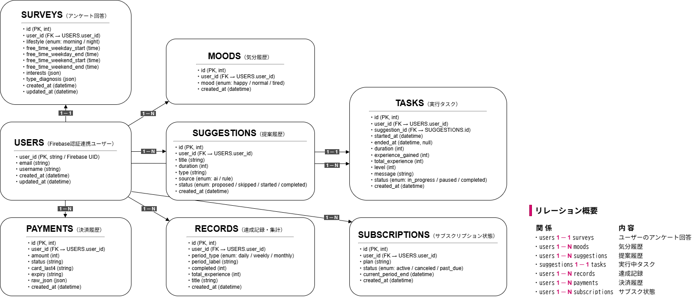

# 🕐 Motibo（モチボ）

**あなたの気分と性格に合わせて、“ちょうどいい行動”を提案する習慣化アプリ。**

---

## 🚀 プロジェクト概要

**Motibo** は、AI（OpenAI GPT-5）を活用して、  
ユーザーの「気分」「性格」「生活リズム」に合わせた行動提案を行い、  
小さな達成を積み重ねることで前向きな毎日をサポートする、  
スケジュール習慣化アプリです。

---

## 🧩 技術構成

```bash
project-root/
├── frontend/   # Next.js (App Router, TypeScript, SWR, Tailwind CSS, Framer Motion)
├── backend/    # Express.js (TypeScript, Firestore, OpenAI API, Stripe)
└── docker-compose.yml
```

---

## 🗄 DB設計

- ER 図（画像）: 
- ER 図（draw.io ソース）: [docs/db/db-schema.drawio](./docs/db/db-schema.drawio)


---

| 区分 | 使用技術 |
|------|-----------|
| フロントエンド | Next.js 15 / React 19 / TypeScript / Tailwind CSS / SWR / Framer Motion |
| バックエンド | Express.js / TypeScript / Firebase Firestore / Zod / OpenAI API / Stripe |
| インフラ | Docker / Vercel (Frontend) |
| 開発補助 | ESLint (Airbnb) / Prettier / Swagger UI |

---

## 🧠 主な機能

- 気分入力（high / normal / low）
- AI提案（OpenAI GPT-5 による行動提案）
- 提案スキップ → 「休む」誘導
- タイマー機能 & 行動完了記録
- XP（経験値）によるヒーローレベル成長
- 記録画面（日 / 週 / 月）
- Stripe による有料プラン（Lv.10以上）
- Firebase Auth（認証）

---

## 🛠 セットアップ手順

### 1️⃣ クローン & 環境変数設定

```bash
git clone https://github.com/ms-engineer-bc25-05/team-a-final-project.git
cd team-a-final-project
cp .env.example .env
```
.env / .env.local に Firebase・OpenAI・Stripe などのキーを設定してください。

### 2️⃣ Docker で起動

```bash
docker compose build
docker compose up
```

- Frontend → [http://localhost:3000](http://localhost:3000)  
- Backend → [http://localhost:4000](http://localhost:4000)

---
## 📡 API エンドポイント一覧

| メソッド | エンドポイント | 概要 |
|-----------|----------------|------|
| GET | `/api/suggestions` | 行動提案を取得 |
| POST | `/api/records` | 行動記録を追加 |
| GET | `/api/records/daily` | 日ごとの記録を取得 |
| POST | `/api/payments/create-checkout-session` | Stripe 決済開始 |
| POST | `/api/stripe/webhook` | Stripe Webhook 受信 |
| GET | `/api/heartbeat` | ユーザー稼働確認 |

Swagger UI にて API 仕様を確認可能：  
👉 [http://localhost:4000/api-docs](http://localhost:4000/api-docs)

---

## 🧪 テスト

### 現在の状態
Vitest を用いた自動テストは今後実装予定ですが、  
統合テスト用ページ `/short-test` を追加し、  
バックエンドを改修せずにフロント側から以下のAPI疎通確認が可能です。

| テスト内容 | エンドポイント | 期待結果 |
|-------------|----------------|-----------|
| OpenAI 応答テスト | `POST /api/openai/short` | 入力テキストに対して JSON 応答が返る |
| ハートビート登録 | `POST /api/heartbeat` | Firestore にレコード追加 |
| ハートビート一覧 | `GET /api/heartbeats` | 未実装でも「データなし」で継続 |
| 行動提案取得 | `GET /api/suggestions` | Reload で 3 件のカードが表示（429 でも継続） |

### 今後の予定
- 各 API（/users, /suggestions, /records など）の正常系・異常系テストを Vitest で追加  
- `npm run test` による自動実行設定  
- Postman コレクションを自動化テストに組み込み

---

## 🎨 デザイン指針

- メインカラー：`#B6E6F3`（やわらかい水色）  
- コンセプト：**癒し × 冒険**  
- ヒーローのレベルに応じた Pixel Art の進化  
- Framer Motion による「呼吸アニメーション」で柔らかい動き表現  

---

## ⚙️ 使用バージョン

| 区分 | ライブラリ | バージョン |
|------|-------------|-------------|
| Frontend | Next.js | 15.5.4 |
|  | React | 19.1.0 |
|  | TypeScript | 5.9.3 |
|  | Tailwind CSS | 4.1.14 |
| Backend | Express | 5.1.0 |
|  | TypeScript | 5.9.3 |
|  | ts-node | 10.9.2 |
|  | nodemon | 3.1.10 |
|  | cors | 2.8.5 |

---

## ☁️ デプロイ構成

| サービス | ホスティング | URL |
|-----------|---------------|-----|
| Frontend | Vercel | https://motibo.vercel.app |
| Backend | Render |**未デプロイ（ローカル環境で動作確認済）** |
| DB | Firebase Firestore | - |

> ※ Backend（Render）は今後デプロイ予定です。

---

## 🪄 開発メンバー

| 役割 | 名前 | 主な担当 |
|------|------|-----------|
| 🧩 フロントエンド & UI/UX | **しお** | 画面設計・デザイン・Framer Motion・AI 提案 UI |
| 🔧 バックエンド & AI | **まいまい** | Express / Firestore / OpenAI / Stripe |
| ☁️ インフラ & 認証 | **ひらまゆ** | Firebase Auth / Stripe Webhook / デプロイ構築 |

---

## 💬 今後の展望

- LLM 応答高速化（キャッシュ層導入）  
- 提案履歴を考慮したパーソナライズ精度向上  
- プレミアム専用ヒーロー進化アニメーション  
- モバイルアプリ対応（iOS / Android）

---

## 📝 ライセンス

MIT License

---

> © 2025 Team-A — Ms.Engineer Bootcamp Final Project  
> Created with ❤️ by ひらまゆ・まいまい・しお
